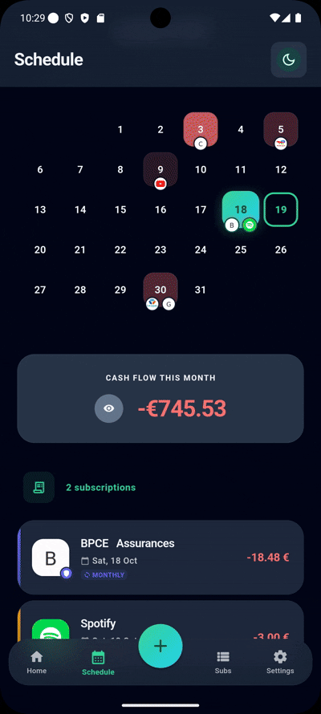
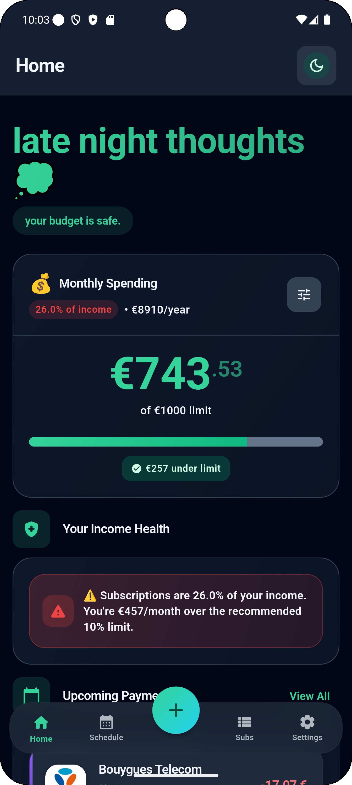
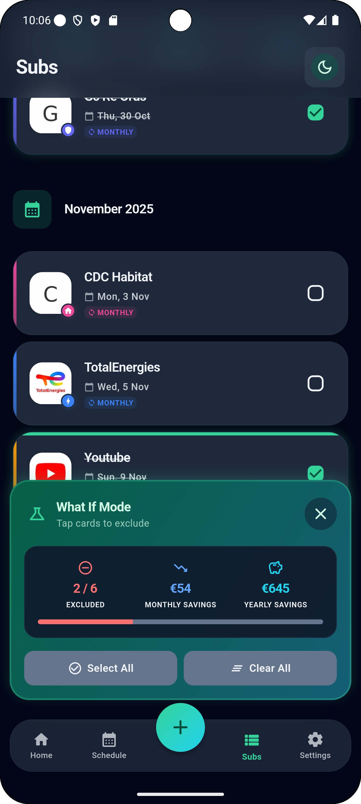
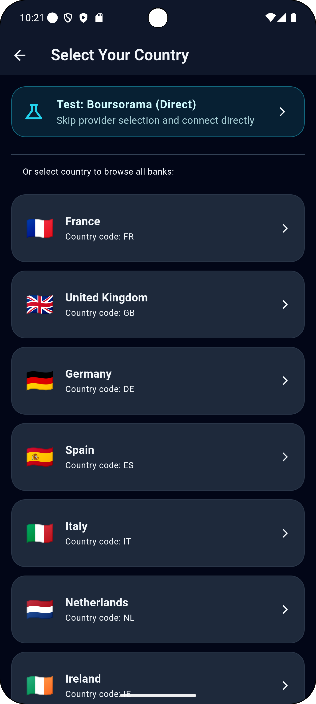
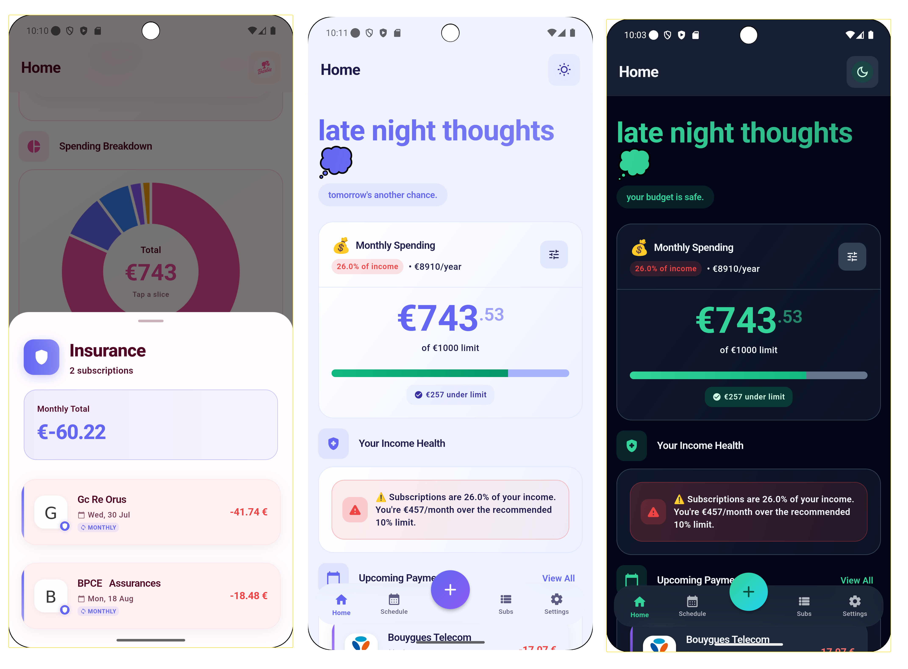

# Tr'Hack 

<div align="center">
</div>

<div align="center">


<br/><br/>


**A modern subscription management app that helps you take control of your recurring payments**

[Features](#-features) • [Screenshots](#-screenshots) • [Getting Started](#-getting-started)

</div>

---

## 🎯 About

Tr'Hack is a beautifully designed Flutter application that transforms how you manage your subscriptions and recurring payments. Built with modern UX/UI principles and Gen Z aesthetics, it provides powerful financial insights while maintaining a delightful user experience.

Whether you're tracking Netflix, Spotify, or your gym membership, Tr'Hack helps you visualize spending patterns, set budgets, and discover potential savings—all in a polished, themeable interface.

## ✨ Features

### 🎨 **Modern UI/UX**
- Glassmorphism design elements
- Smooth animations and transitions
- Multiple themes (Light, Dark, Barbie)
- Responsive layout for all screen sizes

### 📊 **Smart Tracking**
- **Manual Entry**: Beautiful multi-step UI for adding subscriptions
- **Auto-Detection**: Connect your bank via TrueLayer Open Banking API
- **Interactive Calendar**: Visualize all payments with monthly cash flow summaries
- **Real-time Insights**: Track spending against your budget

### 🎮 **Gamification**
- XP and level system
- Achievements for financial milestones
- Progress tracking for goals

### 💡 **"What If" Mode**
- Temporarily exclude subscriptions
- See instant impact on monthly/yearly savings
- Make informed decisions about your subscriptions

### 🔔 **Smart Notifications**
- Customizable payment reminders
- Push notifications for upcoming bills
- Never miss a payment deadline

## 🎥 Demo

<div align="center">



*Watch Tr'Hack in action: Navigate subscriptions, toggle What If mode, and see instant savings calculations*

</div>

## 📱 Screenshots

<div align="center">

### Core Features

  

### Beautiful Multi-Step Add Subscription Flow


### Smart Insights & Unique Features

  

### Customization & Details

 

</div>

## 🚀 Getting Started

### Prerequisites

- Flutter SDK 3.x or higher ([Install Flutter](https://flutter.dev/docs/get-started/install))
- Dart SDK 3.x or higher
- iOS Simulator / Android Emulator or Physical Device

### Installation

1. **Clone the repository**
   ```bash
   git clone https://github.com/aadatech/trhack_app.git
   cd trhack_app
   ```

2. **Set up environment variables**

   Create a `.env` file in the project root:
   ```env
   TRUELAYER_CLIENT_ID=your_client_id_here
   TRUELAYER_CLIENT_SECRET=your_client_secret_here
   ```

3. **Install dependencies**
   ```bash
   flutter pub get
   ```

4. **Run the app**
   ```bash
   flutter run
   ```

### Tech Stack

| Technology | Purpose |
|------------|---------|
| **Flutter** | Cross-platform UI framework |
| **Provider** | State management solution |
| **Hive** | Fast, local NoSQL database |
| **TrueLayer API** | Open Banking integration |
| **fl_chart** | Beautiful interactive charts |
| **webview_flutter** | OAuth authentication flow |

## 🎨 Design System

Tr'Hack implements a comprehensive design system with:
- Consistent color palettes across themes
- Typography scale for hierarchy
- Reusable component library
- Accessibility-first approach

## 🤝 Contributing

Contributions make the open-source community an amazing place to learn and create. Any contributions you make are **greatly appreciated**!

1. Fork the Project
2. Create your Feature Branch (`git checkout -b feature/AmazingFeature`)
3. Commit your Changes (`git commit -m 'Add some AmazingFeature'`)
4. Push to the Branch (`git push origin feature/AmazingFeature`)
5. Open a Pull Request

### Development Guidelines

- Follow the [Flutter Style Guide](https://github.com/flutter/flutter/wiki/Style-guide-for-Flutter-repo)
- Write meaningful commit messages
- Add tests for new features
- Update documentation as needed

## 🐛 Bug Reports

Found a bug? Please open an issue with:
- Clear description of the problem
- Steps to reproduce
- Expected vs actual behavior
- Screenshots (if applicable)
- Device/platform information

## 📋 Roadmap

- [ ] Add support for cryptocurrency subscriptions
- [ ] Implement subscription sharing with family members
- [ ] Add export functionality (CSV, PDF)
- [ ] Multi-currency support
- [ ] Bill negotiation assistant
- [ ] Integration with more banking providers

## 📄 License

Distributed under the MIT License. See `LICENSE` file for more information.

## 👥 Authors

**AadaTech**
- Email: contact.aadatech@gmail.com

## 🙏 Acknowledgments

- [TrueLayer](https://truelayer.com/) for Open Banking API
- [Flutter Community](https://flutter.dev/community) for amazing packages
- All contributors who help improve Tr'Hack

---

<div align="center">

**⭐ Star this repo if you find it helpful!**

Made with ❤️ by Njm

</div>