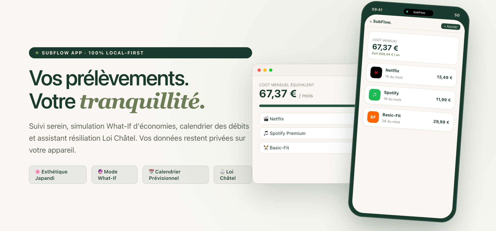
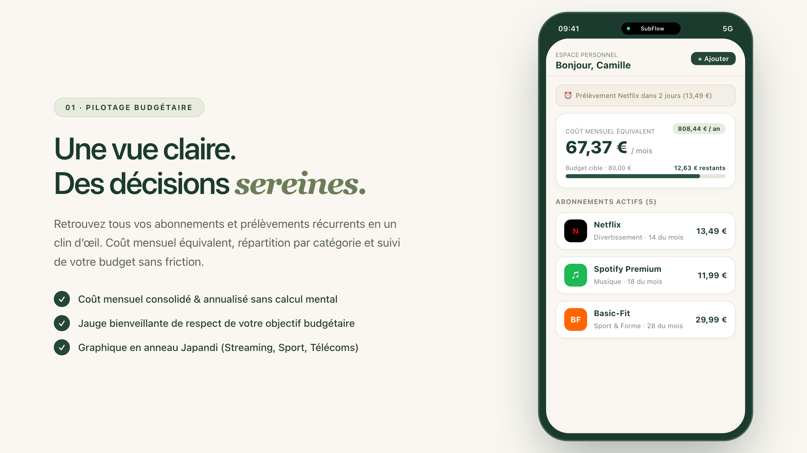
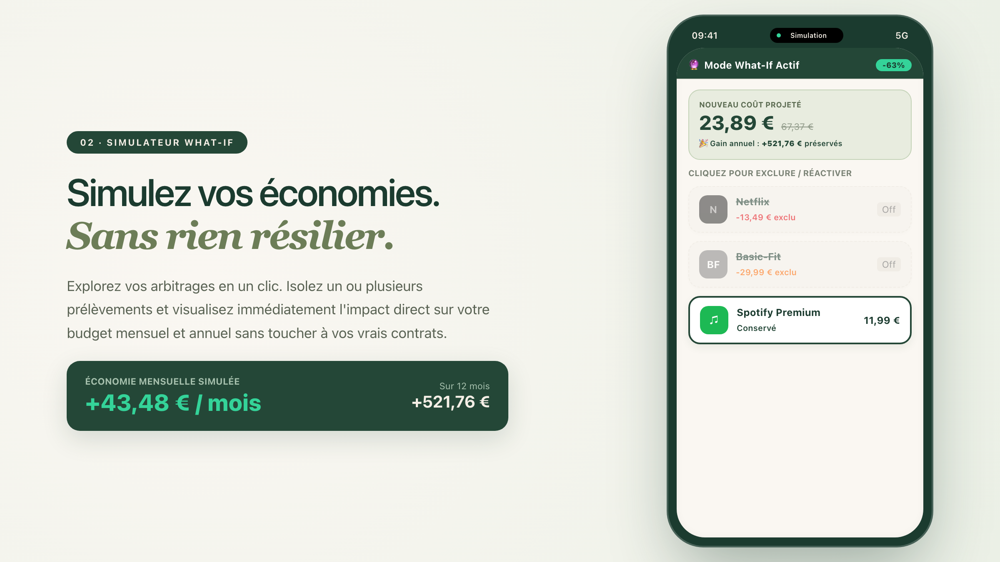
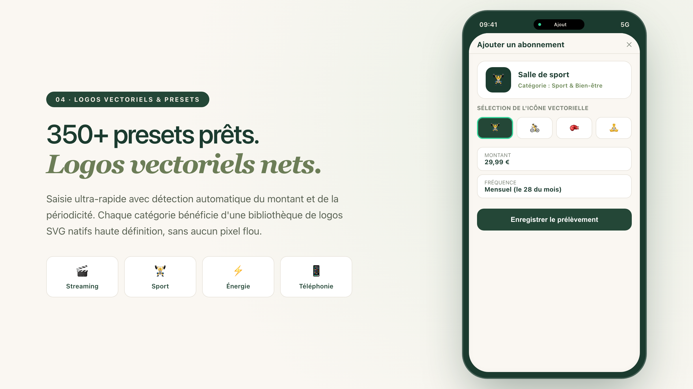
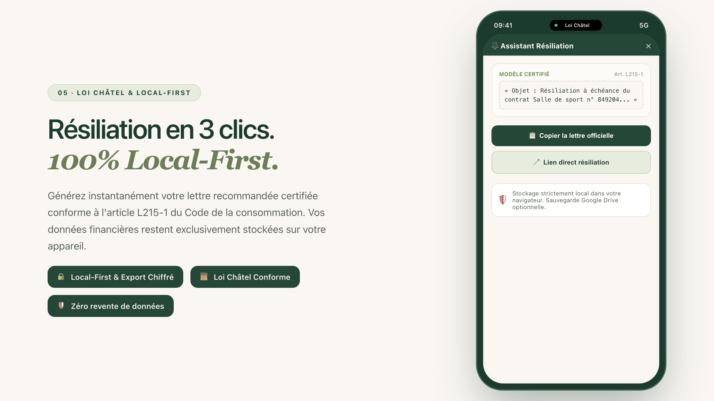
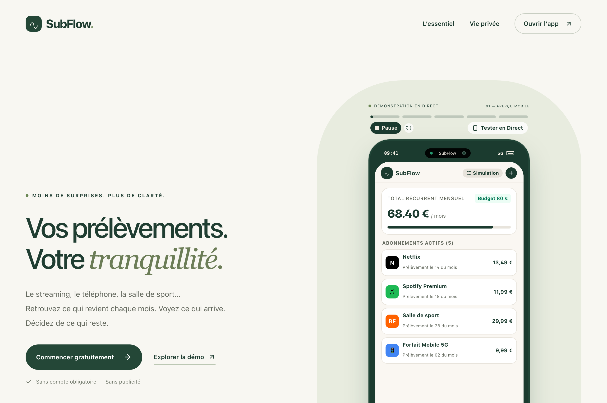

<div align="center">

# 🌿 SubFlow

**Gestion sereine des abonnements et prélèvements récurrents**

[](https://nextjs.org)
[](https://www.typescriptlang.org)
[](https://tailwindcss.com)
[](https://turbo.build)
[](#-vie-privée--sécurité-radicale)
[](#-qualité--tests)
[](https://subflowapp.vercel.app)
[](LICENSE)

<br/>

**Anticipez ce qui revient chaque mois. Visualisez vos prochaines échéances. Simulez vos économies en direct.**

[🌐 **Accéder à l'application en direct**](https://subflowapp.vercel.app) • [🎮 **Tester la démo interactive**](https://subflowapp.vercel.app/demo) • [📑 **Spécifications & Qualification**](docs/QUALIFICATION_SUBFLOW.md)

<br/>

<p align="center">
  
</p>

</div>

---

## 🎯 Vision & Philosophie : Le Calme dans vos Dépenses

Dans un monde submergé d'abonnements invisibles (streaming, forfaits, abonnements sportifs, logiciels SaaS), l'argent s'échappe souvent sans bruit. 

**SubFlow** a été conçu selon les principes du **Japandi UI** (alliance de l'esthétique minimaliste japonaise *Wabi-Sabi* et du fonctionnalisme scandinave *Lagom*) :
- **Zéro bruit mental** : Pas de comptabilité générale complexe, de catégorisations inutiles ni de graphiques agressifs.
- **Transparence radicale** : Vos données financières restent strictement sur votre appareil (Local-First). Aucune création de compte requise, aucun traqueur publicitaire, aucune revente d'informations.
- **Contrôle éclairé** : Des outils d'anticipation et de simulation pour prendre les bonnes décisions sans friction ni mauvaise surprise en fin de mois.

---

## 📱 Galerie Marketing & Visuels de l'Application

Les captures ci-dessous présentent les écrans et fonctionnalités réels de l'application SubFlow, optimisés aux standards visuels d'Apple App Store et Google Play Store.

### 01 · Pilotage Budgétaire & Coût Consolidé
> *Une vue claire de vos dépenses récurrentes, sans calcul mental.*

<p align="center">
  
</p>

- **Coût mensuel équivalent lissé** : Les abonnements annuels, semestriels ou trimestriels sont automatiquement ramenés à leur coût mensuel exact pour apprécier votre charge réelle.
- **Jauge budgétaire bienveillante** : Suivi en direct du reste à vivre sur votre budget cible fixé, sans culpabilisation.
- **Ventilation par catégorie** : Anneau Japandi équilibré distinguant Divertissement, Utilitaires, Forme et Numérique.

---

### 02 · Simulateur d'Économies What-If
> *Simulez vos arbitrages budgétaires sans toucher à vos contrats réels.*

<p align="center">
  
</p>

- **Arbitrage sans risque** : Cochez ou décochez temporairement un abonnement pour évaluer son impact.
- **Calcul d'impact immédiat** : Visualisez instantanément l'économie mensuelle réalisée et son équivalent sur 12 mois.
- **Séparation hermétique** : Aucun service n'est résilié ou altéré dans votre liste réelle lors des simulations.

---

### 03 · Calendrier Prévisionnel des Échéances
> *Zéro mauvaise surprise sur votre compte bancaire en fin de mois.*

<p align="center">
  
</p>

- **Échéancier jour par jour** : Vue mensuelle interactive affichant chaque date de prélèvement avec pastille colorée.
- **Notification préventive à J-2** : Alerte proactive pour anticiper le passage d'un montant important sur votre compte.
- **Prélèvements groupés** : Détection des journées à débits multiples pour garantir la provision sur votre compte courant.

---

### 04 · Catalogue 350+ Presets & Logos Vectoriels SVG
> *Ajoutez un prélèvement en 3 secondes avec une reconnaissance visuelle impeccable.*

<p align="center">
  
</p>

- **350+ presets français et internationaux** : Netflix, Spotify, Canal+, Basic-Fit, Free, Orange, EDF, iCloud, ChatGPT, etc.
- **Logos vectoriels SVG natifs** : Attribution immédiate d'icônes nettes et colorées selon la catégorie (Film, Musique, Énergie, Sport, etc.).
- **Zéro pixel flou** : Filtrage strict éliminant les fallbacks génériques basse définition ou les logos d'entreprises non liées.
- **Personnalisation complète** : Sélecteur direct permettant de changer la couleur et l'icône de n'importe quel abonnement.

---

### 05 · Assistant Résiliation Loi Châtel & Local-First
> *Faites valoir vos droits de consommateur en 3 clics.*

<p align="center">
  
</p>

- **Conformité Article L215-1 (Loi Châtel)** : Alerte à l'approche de la date anniversaire de reconduction tacite de vos contrats.
- **Générateur de lettre recommandée certifiée** : Modèle officiel pré-rempli avec les références de votre contrat, prêt à être copié ou envoyé en Lettre Recommandée Électronique (LRE).
- **Accès direct en 3 clics** : Redirection vers la page exacte de gestion et de désabonnement du fournisseur.

---

### 06 · Landing Page avec Démonstration Vidéo Mobile Interactive
> *Une vitrine vivante intégrant un véritable simulateur iPhone 16 dans le Hero.*

<p align="center">
  
</p>

- **Séquence vidéo publicitaire (style TikTok / Reels)** : Déroulé automatique en 5 scènes avec barres de progression et pointeur tactile animé.
- **Mode « Tester en direct »** : Possibilité pour chaque visiteur de manipuler librement l'interface mobile directement depuis la page d'accueil sans rien installer.

---

## 🏗️ Architecture Technique (Monorepo Turborepo)

SubFlow est orchestré sous forme de monorepo moderne géré avec **pnpm workspaces** et **Turborepo** :

```
subflow/
├── apps/
│   └── web/                   # Application Next.js 15 (App Router, Tailwind CSS, Lucide Icons)
│       ├── src/app/           # Routes: /, /app, /demo, /schedule, /subs, /settings, /privacy
│       ├── src/components/    # Modales, TopBar, HeroMobileAdSimulator, Donut, CategoryIcons
│       └── src/store/         # État Zustand persistant (localStorage) avec isolation démo
├── packages/
│   ├── core/                  # Logique métier pure (indépendante du framework)
│   │   ├── src/math/budget.ts # Calculs lissés, annualisation, simulation What-If
│   │   ├── src/backup/        # Export CSV & Chiffrement de sauvegarde AES-GCM
│   │   ├── src/validation/    # Schémas de validation Zod stricts
│   │   └── src/i18n/          # Dictionnaire français complet
│   ├── ui/                    # Bibliothèque de composants graphiques partagés
│   ├── tailwind-config/       # Tokens design Japandi (palette de couleurs, typographie)
│   └── tsconfig/              # Configurations TypeScript strictes
└── lib/                       # Implémentation mobile native Flutter (Flutter 3.x / Dart)
```

---

## ⚡ Installation & Démarrage Rapide

### Prérequis
- **Node.js** >= 20.x
- **pnpm** >= 9.x (ou 10.x)

### 1. Cloner et installer les dépendances
```bash
git clone https://github.com/fnnktkygl-code/subflow.git
cd subflow
pnpm install
```

### 2. Lancer les tests unitaires et d'intégration
```bash
pnpm test
```
> **131 tests unitaires validés** couvrant la logique de budget, le calendrier, la sauvegarde chiffrée, la sécurité et la détection d'abonnements.

### 3. Démarrer le serveur de développement Web
```bash
pnpm --filter @subflow/web dev
```
L'application est immédiatement accessible sur `http://localhost:3000`.

### 4. Compiler pour la production
```bash
pnpm run build
```

---

## 🔒 Vie Privée & Sécurité Radicale

SubFlow adopte une politique d'intégrité absolue envers vos données personnelles :

| Principe | Implémentation dans SubFlow |
|---|---|
| **Local-First** | Vos données sont enregistrées exclusivement dans le stockage local de votre navigateur (`localStorage`). Aucun serveur central ne stocke vos informations personnelles. |
| **Zéro Tracking** | Aucun cookie publicitaire, aucun SDK analytique intrusif, aucune revente de données à des tiers. |
| **Sauvegarde Sécurisée** | Export de vos données sous format JSON chiffré par mot de passe avec l'algorithme standard **AES-GCM (PBKDF2)**. |
| **Sauvegarde Cloud Optionnelle** | Synchronisation Google Drive strictement optionnelle, utilisant votre propre compte Google via OAuth 2.0 avec consentement explicite. |
| **Conformité RGPD & Loi Châtel** | Suppression définitive de toutes vos données locales en un clic depuis les paramètres. |

---

## 🧪 Qualité & Tests

Le projet est validé en continu par une suite de tests automatisés rigoureuse :
- **Calculs budgétaires & récurrences décennales** : Testé sur 10 000 récurrences calendaires pour garantir une exécution en moins de 800 ms sans fuite mémoire.
- **Régression de sécurité & sanitisation** : Vérification stricte des entrées utilisateurs, protection XSS et validation des schémas Zod.
- **Résolution des logos & SVG** : Tests unitaires vérifiant l'interdiction formelle des noms génériques réservés et la cohérence des catégories.

---

## 📄 Licence

Distribué sous licence **MIT**. Consultez le fichier `LICENSE` pour plus d'informations.

<div align="center">
  <sub>Développé avec soin et sérénité · Conçu pour préserver votre tranquillité financière.</sub>
</div>
